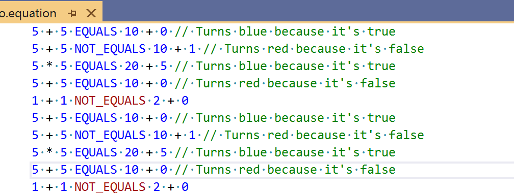

# Language Server Semantic Colorization Sample
This sample implements a simple language server extension for Visual Studio using the
[common language protocol](https://microsoft.github.io/language-server-protocol/specification)'s
'textDocument/semanticTokens/*' messages to implement server provided semantic text colorization.

This sample implements support for a trivial language composed of simple math expressions of the
form "W + X EQUALS Y + Z".

It uses a TextMate language file (.tmlanguage) to provide basic syntactic
colorization and semantic tokens protocol to implement the language server
provided "semantically aware" colorization of EQUALS and NOT_EQUALS keywords
in each expression to indicate whether the expression is true or false.

**Requirements**
* [ Visual Studio 2019 Preview](https://visualstudio.com/vs)
* Visual Studio Extensibility workload

**Run the sample**
* To build and execute the sample, press F5 after the sample is loaded.
* In the experimental instance of Visual Studio, open a *.equation file.
* You will see a simple language with syntax highlighting. A few seconds later,
  you should see highlighting for EQUALS/NOT_EQUALS provided by the language server.

**Related topics**
* [Language Server Protocol](https://docs.microsoft.com/en-us/visualstudio/extensibility/language-server-protocol)
* [Creating a language server extension in Visual Studio](https://docs.microsoft.com/en-us/visualstudio/extensibility/adding-an-lsp-extension)
* [ Visual Studio SDK Documentation ](https://docs.microsoft.com/en-us/visualstudio/extensibility/visual-studio-sdk)
